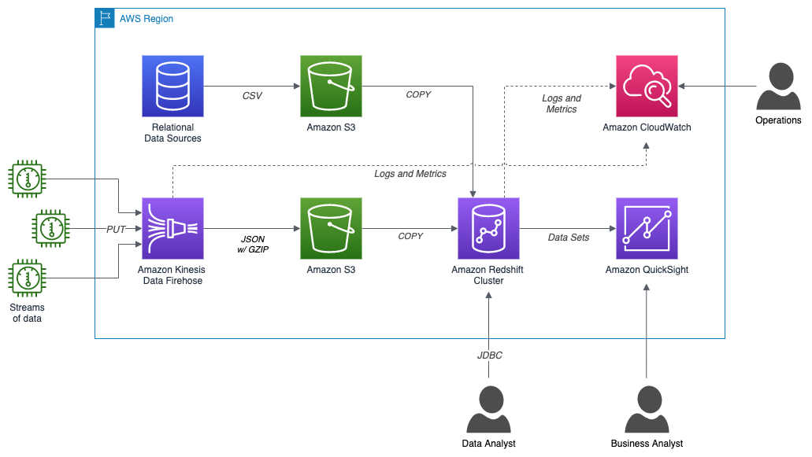

# Streaming Data Analytics with Amazon Kinesis Data Firehose, Amazon Redshift, and Amazon QuickSight

Project files for the accompanying post, [Streaming Data Analytics with Amazon Kinesis Data Firehose, Amazon Redshift, and Amazon QuickSight](https://tinyurl.com/streamingwarehouse). See post for the most up-to-date instructions.

## Architecture



## Setup Commands

```bash
export AWS_DEFAULT_REGION=us-east-1
REDSHIFT_USERNAME=awsuser
REDSHIFT_PASSWORD=5up3r53cr3tPa55w0rd

# Create resources
aws cloudformation create-stack \
    --stack-name redshift-stack \
    --template-body file://cloudformation/redshift.yml \
    --parameters ParameterKey=MasterUsername,ParameterValue=${REDSHIFT_USERNAME} \
                 ParameterKey=MasterUserPassword,ParameterValue=${REDSHIFT_PASSWORD} \
                 ParameterKey=InboundTraffic,ParameterValue=$(curl ifconfig.me -s)/32 \
    --capabilities CAPABILITY_NAMED_IAM

# Wait for first stack to complete
aws cloudformation create-stack \
    --stack-name kinesis-firehose-stack \
    --template-body file://cloudformation/kinesis-firehose.yml \
    --parameters ParameterKey=MasterUserPassword,ParameterValue=${REDSHIFT_PASSWORD} \
    --capabilities CAPABILITY_NAMED_IAM

# Get data bucket name
export DATA_BUCKET=$(aws cloudformation describe-stacks \
    --stack-name redshift-stack \
    | jq -r '.Stacks[].Outputs[] | select(.OutputKey == "DataBucket") | .OutputValue')

echo ${DATA_BUCKET}

# Copy sample data
aws s3 cp data/history.csv s3://${DATA_BUCKET}/history/history.csv
aws s3 cp data/location.csv s3://${DATA_BUCKET}/location/location.csv
aws s3 cp data/manufacturer.csv s3://${DATA_BUCKET}/manufacturer/manufacturer.csv
aws s3 cp data/sensor.csv s3://${DATA_BUCKET}/sensor/sensor.csv
aws s3 cp data/sensors.csv s3://${DATA_BUCKET}/sensors/sensors.csv

# Copy to redshift using sql
python3 -m pip install --user --upgrade pip
python3 -m pip install -r scripts/requirements.txt --upgrade

python3 ./scripts/kinesis_put_test_msg.py

python3 ./scripts/kinesis_put_streaming_data.py
```

## Long Running Script on EC2 Instance

```bash
yes | sudo yum update
yes | sudo yum install python3 git htop
python3 --version
git clone git clone git@github.com:garystafford/kinesis-redshift-streaming-demo.git
python3 -m pip install --user --upgrade pip
python3 -m pip install -r scripts/requirements.txt --upgrade

# Run script as background process
export AWS_DEFAULT_REGION=us-east-1
nohup python3 ./scripts/kinesis_put_streaming_data.py > output.log &

ps -aux | grep kinesis
```

## Cleaning Up

```bash
# Get data bucket name
export DATA_BUCKET=$(aws cloudformation describe-stacks \
    --stack-name redshift-stack \
    | jq -r '.Stacks[].Outputs[] | select(.OutputKey == "DataBucket") | .OutputValue')

echo ${DATA_BUCKET}

# Get log bucket name
export LOG_BUCKET=$(aws cloudformation describe-stacks \
    --stack-name redshift-stack \
    | jq -r '.Stacks[].Outputs[] | select(.OutputKey == "LogBucket") | .OutputValue')

echo ${LOG_BUCKET}

# Delete demonstration resources
python3 ./scripts/delete_buckets.py

aws cloudformation delete-stack --stack-name kinesis-firehose-stack

# Wait for first stack to be deleted
aws cloudformation delete-stack --stack-name redshift-stack
```

## References

<https://docs.aws.amazon.com/firehose/latest/dev/controlling-access.html#using-iam-rs>
<https://docs.aws.amazon.com/redshift/latest/gsg/rs-gsg-create-sample-db.html>
<https://noise.getoto.net/tag/aws-lake-formation/>
<https://www.tutorialspoint.com/dwh/dwh_schemas.htm>
